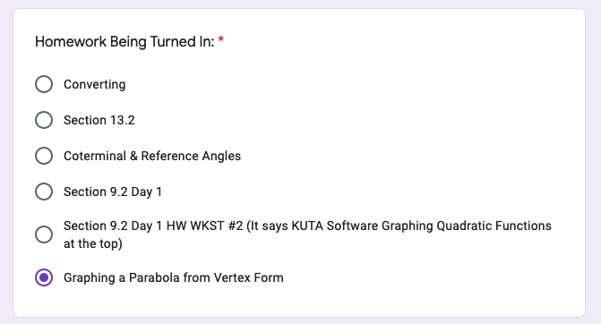

<!--ha ha funny things
	There was a tragic event last night there was a kid named Jacob who spilled some mashed potatoes on his plate most people thought it was funny but the man who is making us write this did not find it funny, and this is that story. Before we start I would like to give a thesis about this topic. 
-->
# Distence learning time
## other
[MarkDown Cheatsheet](https://github.com/adam-p/markdown-here/wiki/Markdown-Cheatsheet "On Github")

cool [website](https://www.windows93.net "windows93")

Erin Maynes [youtube channel](https://www.youtube.com/channel/UCkH9EgsUJJhHA4SB_eg1g4g "youtube channel")

### inportent links for FLC
[audio](https://shakespeare.folger.edu/listen/romeo-and-juliet/ "audio")

[text](https://www.folgerdigitaltexts.org/html/Rom.html#line-1.1.0 "book")

[quizlet](https://quizlet.com/_6emoag?x=1jqt&i=13lg3c "quizlet")

***

## live classes
1. Band
	* TBD
2. Physical Science
	* Thursdays
3. Amarican History
	* TBD
4. App Dev
	* Wednesday and Fridays
5. FLC
	* TBD
6. Math
	* TBD

## school

### april 20
1. Band
2. Physical Science
	* ~~watch [video](https://youtu.be/yQP4UJhNn0I "video")~~
3. American History
	* ~~watch [video](https://uaschools.instructure.com/courses/4142/files/584217/download?wrap=1 "video")~~
	* final [Project](https://uaschools.instructure.com/courses/4142/assignments/38083 "final") for unit 12
4. App Dev
	* unit 15
5. FLC
	* ~~[video](https://uaschools.schoology.com/system/files/attachments/files/m/202004/course/2150433587/RJ_Recap_Video_5e9a0aa43f1b0.mp4 "video")~~
	* ~~fill out [forms](https://forms.gle/GEVa1jCJs4tkSYu57 "forms")~~
	* do [this](https://docs.google.com/document/d/1-0jzfM3DS-dgqcLHDl7eexUapMEKUCsSOA1ILrfsD9A/edit "assiment")
6. Math
	* turn in [form](https://docs.google.com/forms/d/e/1FAIpQLSdkUlR94rTIFbjzMdlSuOp5zB_Y1t50VNBNtSemCBYzNnMZyg/viewform?usp=sf_link "form")
---

### april 21
1. Band
2. Physical Science
	* ~~watch [video](https://drive.google.com/file/d/1gbr7e5hyCbDvYau-tmak7MuOiyVOrgod/view?usp=sharing "video") fill out [worksheet](https://drive.google.com/file/d/0B7GiQq4i5D4oN2pZOFNNQzZNbFROZXprOG1wZXRkbklpNXBZ/view?usp=sharing "worksheet")~~
3. American History
	* ~~watch [video](https://uaschools.instructure.com/courses/4142/files/586009/download?wrap=1 "video")~~
4. App Dev
	* unit 15
5. FLC
	* ~~[lison](https://shakespeare.folger.edu/listen/romeo-and-juliet/ "audio") and [book](https://www.folgerdigitaltexts.org/html/Rom.html#line-1.1.0 "book")~~
	* [anotate](https://docs.google.com/document/d/1K14uXUnSSMWP-6d1QDIGBjcfVjnb5E0BuxA7LkmTvCk/edit "worksheet")
	* ~~[watch](https://edpuzzle.com/assignments/5e99da98a5b7d33f14e5e890/watch "video")~~
6. Math
	* turn in [form](https://docs.google.com/forms/d/e/1FAIpQLSdkUlR94rTIFbjzMdlSuOp5zB_Y1t50VNBNtSemCBYzNnMZyg/viewform?usp=sf_link "form")
	* Complete the Vertex & Intercept Form of a Quadratic HW [WKST]()
	* do 
---

### april 22
1. Band
2. Physical Science
	* ~~do [this](https://drive.google.com/file/d/1Weq_DcWz0Bv6KWXkeg0cTSXwNL45deLt/view?usp=sharing "worksheet") w/ periodic table~~
3. American History
	* [video](https://uaschools.instructure.com/courses/4142/files/587979/download?wrap=1 "video")
4. App Dev
	* unit 15
5. FLC
	* watch [video](https://edpuzzle.com/assignments/5e99ba833f921f3f0dc81e07/watch "video")
	* play [game](http://quizizz.com/join?gc=825198 "quizizz")
	* [Act 1 journnal prompt](https://docs.google.com/document/d/1-0jzfM3DS-dgqcLHDl7eexUapMEKUCsSOA1ILrfsD9A/edit?usp=sharing "thing")
	* [prolouge anoutation](https://docs.google.com/document/d/1ei6xkxXxQ9MfNl3T8A91w9bP85Sf7gBOV9wwbPYulVM/edit?usp=sharing)
6. Math
	1. Homeworks
		* [Quadratic Formula Review](https://www.yumpu.com/en/document/read/43224976/134-hw-quadratic-formula-worksheet-intropdf "ban")
		* [Section 9.2 Day 1 HW WKST #2 ](https://uaschools.schoology.com/system/files/attachments/files/m/202004/course/2153651014/Algebra_Section_9.2_Day_1_HW_WKST_2_5e8f679c1feb6.pdf "worksheet")
		* [Section 9.2 Day 1]()
		* [Graphing a Parabola from Vertex Form](https://uaschools.schoology.com/system/files/attachments/files/m/202004/course/2153651014/Algebra_Section_9.2_Day_1_5e8cead80548d.pdf)
		* [Vertex & Intercept Form of a Quadratic HW WKST](https://uaschools.schoology.com/system/files/attachments/files/m/202004/course/2153651014/Quarter_4_Algebra_Vertex_and_Intercept_Form_HW_WKST_5e99bee2d53db.pdf "nice")
		* turn in [form](https://docs.google.com/forms/d/e/1FAIpQLSe8L5W8V8cN7BH8qxaZyiDFser0az3-v4arH7sfjPllK3nYRQ/viewform?usp=sf_link "form")
	1. today
		* watch [video](https://www.youtube.com/watch?v=EvxELyypQu8)
---

### april 23
1. Band
2. Physical Science
	* [notes](https://drive.google.com/file/d/0B7GiQq4i5D4odHRYT3FNWWR0dFZIR25ZeklKSGFQUTl6Z1pj/view?usp=sharing)
3. American History
4. App Dev
5. FLC
6. Math
---

<!--

### copy
1. Band
2. Physical Science
3. American History
4. App Dev
5. FLC
6. Math
---

-->